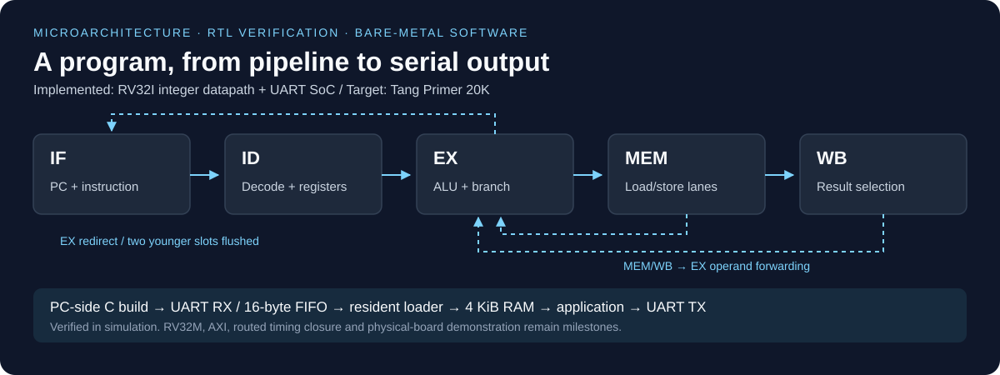

# RISC-V pipeline & FPGA SoC

[](https://github.com/vahidiarsalan-star/rv32im-axi-accelerator/actions/workflows/verify.yml)
[](LICENSE)

A five-stage in-order RISC-V processor with operand forwarding, pipeline hazard
handling, byte-addressable memory operations, and a bare-metal UART loader.
The project connects CPU microarchitecture, synthesizable Verilog, C startup and
linking, serial I/O, and reproducible simulation.

**Current milestone:** an RV32I integer datapath and UART SoC verified in simulation.
The repository name, `rv32im-axi-accelerator`, describes the roadmap: multiplication/
division and an AXI accelerator are planned. This revision does not claim ISA
compliance, FPGA timing closure, or completed physical-board validation.



## Start here

| If you want to… | Read / run |
| --- | --- |
| Review the engineering in five minutes | [Reviewer guide](docs/REVIEWER_GUIDE.md) |
| Understand the datapath and interfaces | [Architecture](docs/ARCHITECTURE.md) · [design decisions](docs/DESIGN_DECISIONS.md) |
| Inspect measured evidence | [Results](docs/RESULTS.md) · [verification coverage](docs/VERIFICATION.md) |
| Reproduce the system demo | [Build and demo instructions](sw/README.md) |
| Assess implementation boundaries | [ISA support](docs/ISA_SUPPORT.md) · [FPGA bring-up status](docs/FPGA_BRINGUP.md) |

## Engineering highlights

- **Data hazards:** EX/MEM and MEM/WB operand forwarding, youngest-producer
  priority, write-first register-file reads, and a conservative load-use bubble.
- **Control flow:** EX-stage branch/jump resolution, JAL/JALR link data, and
  suppression of younger wrong-path side effects.
- **Memory semantics:** little-endian SB/SH/SW lane enables and signed/unsigned
  byte/halfword extraction, exercised with neighbor-byte preservation tests.
- **Hardware/software interface:** 4 KiB SoC RAM, 16-byte receive FIFO, polling
  UART driver, explicit linker regions, and checksummed serial program loading.
- **Verification:** directed and seeded CPU programs, malformed UART frames,
  negative loader commands, fresh C builds, and serially uploaded hello/echo
  programs. Failing simulations and timeouts propagate to CI.

## Reproduce

Requirements: Python 3, Icarus Verilog, and bare-metal RISC-V GCC/binutils on PATH.
The build detects `riscv32-unknown-elf-` or `riscv64-unknown-elf-`; both compile
with `-march=rv32i -mabi=ilp32`.

```sh
git clone https://github.com/vahidiarsalan-star/rv32im-axi-accelerator.git
cd rv32im-axi-accelerator
python sim/run_tests.py
```

Without a cross-compiler, use `python sim/run_tests.py --rtl-only`.
With `--waves`, CPU traces are retained for GTKWave. Every run writes logs and
a source-identified JSON summary to `build/verification/`.

The full regression builds the monitor and applications from source, sends
machine code through the simulated RX pin, and checks TX output:

```text
RV32I C arithmetic demo
37 + 12 = 49
37 - 12 = 25
tick
```

This is a simulated software-on-RTL demo. See the [recorded run](docs/RESULTS.md)
for test counts, tool versions, image sizes, and its limits.

## Repository map

| Directory | Role |
| --- | --- |
| [`rtl/`](rtl/README.md) | CPU, ALU, decoder, register file, SoC, UART |
| [`sim/`](sim/README.md) | Program generators, testbenches, pin observer, regression runner |
| [`sw/`](sw/README.md) | C monitor/applications, startup, linker scripts, portable build |
| [`gowin/`](gowin/README.md) | Tang Primer 20K project, pin/clock constraints, default image |
| [`docs/`](docs/README.md) | Architecture, decisions, evidence, limitations, roadmap |
| [`.github/`](.github/workflows/verify.yml) | Automated verification and contribution templates |

## Next milestones

Improve instruction legality and memory handshakes; infer synchronous FPGA
BSRAM and establish a routed timing baseline; then add RV32M and verify its
edge cases before introducing AXI. Each milestone has acceptance criteria in
the [roadmap](docs/ROADMAP.md). The [accelerator proposal](docs/ACCELERATOR_PLAN.md)
is explicitly future work.

Licensed under [MIT](LICENSE). Contributions: [workflow and review checklist](CONTRIBUTING.md).
