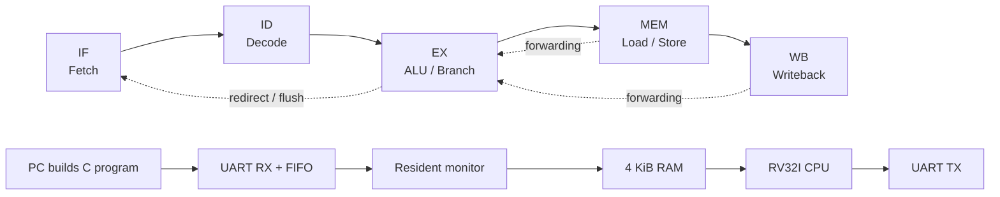

# RV32I Pipelined CPU

[](https://github.com/vahidiarsalan-star/rv32im-axi-accelerator/actions/workflows/verify.yml)
[](LICENSE)

This is my FPGA RISC-V project for the Tang Primer 20K. I built a five-stage
RV32I core, wrapped it in a small SoC, and wrote the firmware and testbenches
needed to run C programs through a UART loader.

The current revision is verified in simulation. RV32M, AXI, and physical-board
bring-up are the next stages of the project; the repository name reflects that
end goal.

## What works

- IF / ID / EX / MEM / WB pipeline
- EX/MEM and MEM/WB forwarding
- One-cycle load-use stall
- Branch and jump recovery in EX
- RV32I integer ALU, branches, jumps, byte/halfword/word loads and stores
- 4 KiB unified RAM, UART TX/RX, 16-byte RX FIFO, and LED register
- Bare-metal C startup and linker scripts
- Resident UART monitor that loads checksummed application images
- Automated CPU, UART, monitor, and compiled C application tests

## Block diagram



## Run the tests

Requirements: Python 3, Icarus Verilog, and a bare-metal RISC-V GCC toolchain.
The scripts detect either a `riscv32-unknown-elf-` or
`riscv64-unknown-elf-` tool prefix.

```sh
python sim/run_tests.py
```

For RTL-only testing:

```sh
python sim/run_tests.py --rtl-only
```

The full regression builds the monitor and applications from source, sends the
applications through the simulated UART RX pin, and checks the serial output.
The current run has 19 passing checks. Details are in
[docs/VERIFICATION.md](docs/VERIFICATION.md) and
[docs/RESULTS.md](docs/RESULTS.md).

Example output from the uploaded C demo:

```text
RV32I C arithmetic demo
37 + 12 = 49
37 - 12 = 25
tick
```

## Repository layout

| Folder | Contents |
| --- | --- |
| [`rtl/`](rtl/) | CPU, decoder, ALU, register file, SoC, and UART RTL |
| [`sim/`](sim/) | Testbenches, test generators, and regression runner |
| [`sw/`](sw/) | Startup code, linker scripts, monitor, and C examples |
| [`gowin/`](gowin/) | Tang Primer 20K project and constraints |
| [`docs/`](docs/) | Architecture, memory map, verification, FPGA status, and roadmap |

## Current status

Simulation is working, including serial loading of freshly compiled `hello.c`
and `echo.c`. The saved Gowin run synthesized but did not complete placement
because reset uses the T10 SSPI pin. The project setting must allow SSPI as
regular I/O before the board build can be completed.

The core is not yet a full compliance target: there are no exceptions, CSRs,
interrupts, privileged modes, or M extension. See
[docs/ARCHITECTURE.md](docs/ARCHITECTURE.md) for the exact implementation and
[docs/ROADMAP.md](docs/ROADMAP.md) for the next steps.

MIT licensed.
