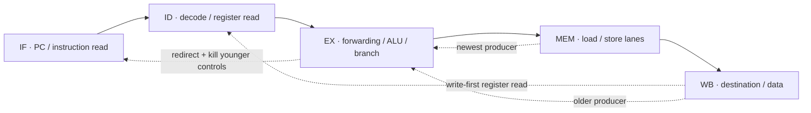

# Architecture and interfaces

This describes the checked-in implementation. The repository name names the
long-term RV32IM/AXI goal; the current core implements an RV32I integer datapath
for controlled bare-metal programs. See [ISA scope](ISA_SUPPORT.md) before
compiling other software.

## CPU organization

Instructions advance in order through IF/ID, ID/EX, EX/MEM, and MEM/WB registers.
IF/ID has a valid bit. Later bubbles are represented by cleared side-effect and
control-transfer bits, rather than by a retirement-valid signal in every stage.
There is no reorder buffer, speculation beyond sequential fetch, or architectural
retirement interface.

| Stage | Work | Relevant state / source |
| --- | --- | --- |
| IF | Select reset PC, sequential PC+4, hold, or redirect | `pc`, `next_pc` in [rv32i_core.v](../rtl/rv32i_core.v) |
| ID | Extract fields and immediates; read two register operands | [decoder.v](../rtl/decoder.v), [regfile.v](../rtl/regfile.v) |
| EX | Select forwarded operands; compute arithmetic, address, branch target and predicate | `fwd_r1`, `fwd_r2`, `branch_taken` |
| MEM | Align the external word address; apply byte enables; extend loads | `dmem_be`, `wdata`, `load_data` |
| WB | Select ALU, load, or PC+4 and update a nonzero destination | `wb_data`, `wb_rd`, `wb_reg_write` |

## Dependencies and control recovery

EX/MEM forwarding has priority over MEM/WB when both destinations match the
consumer: the younger result must win. Destination x0 never forwards. The
EX/MEM value multiplexer selects the actual writeback value (including PC+4
for calls and extended data for loads), not just an ALU address. The two
forwarded register values also feed branch comparison and store data.

The register file explicitly bypasses the current writeback value to matching
read ports. Its initial block initializes registers at power-up/simulation start;
there is no register-file reset port. Software must not assume a warm reset
clears all general-purpose registers. x0 reads as zero and rejects writes.

A load in ID/EX whose nonzero destination matches either raw source field in
IF/ID holds PC and IF/ID for one cycle. It inserts a bubble into ID/EX while
older instructions drain. The detector does not qualify those fields with
`uses_rs1`/`uses_rs2`; some immediate bit patterns can therefore cause an
unnecessary stall. This is a performance limitation, not a feature to count as
useful work.

Branches and jumps resolve in EX. A taken transfer redirects PC and clears
the younger IF/ID instruction and the next ID/EX controls. Two sequentially
fetched instructions can be discarded. PC redirection takes priority over
holding for a stall. JAL/JALR produce PC+4; JALR clears target bit zero.
Instruction misalignment traps are not implemented.

## Core memory contract

Instruction and data reads are combinational. Stores are sampled at a rising
clock edge. The core has separate instruction/data ports, but [soc_top.v](../rtl/soc_top.v)
connects both to one unified memory array with two read paths. There is no
`ready`, response-valid, error, or backpressure signal.

| Signal | Meaning |
| --- | --- |
| `imem_addr`, `imem_rdata` | Byte PC address and same-cycle instruction word |
| `dmem_addr` | Word-aligned data address; low bits are cleared after lane selection |
| `dmem_re` | Load-side access qualifier, including destructive UART FIFO reads |
| `dmem_we`, `dmem_be[3:0]` | Write qualifier and little-endian byte lanes |
| `dmem_wdata`, `dmem_rdata` | Aligned write payload and same-cycle read word |

Byte loads select one of four lanes and sign- or zero-extend. Halfword loads
select the lower or upper half. SB/SH shift both byte enables and payload;
SW enables all four lanes. Only naturally aligned halfword/word accesses are
supported by the software contract. Misaligned accesses do not cross words and
do not trap. A synchronous BSRAM replacement therefore requires a core interface
change, not just changing the RAM declaration.

## SoC and external inputs

The SoC uses the input clock directly: no PLL is instantiated. A four-register
shift chain samples the reset button; the internal reset follows the sampled
button level after four edges. It is not a mechanical debounce circuit. UART RX
uses a two-flop input synchronizer and center sampling. Neither simulation nor
these structures constitute CDC signoff or a measured metastability MTBF.

RX valid pulses feed a 16-byte FIFO. Push advances the write pointer, a qualified
read advances the read pointer, and simultaneous push/pop preserves occupancy.
A pop can make room for a push when the FIFO begins full. Overflow discards the
new byte and sets a sticky overrun bit; framing errors set a separate sticky bit.
Both clear on reset. TX accepts one byte only when idle; software polls busy.

At the default 27 MHz / 115200 setting, integer division yields 234 clocks per
bit (approximately 115384.6 baud, +0.1603% from the requested rate). The timer is
16 bits. Arbitrary parameter choices outside the counter range or with a very
small divisor are not validated by the modules.

Read the [memory map and loader contract](MEMORY_MAP.md),
[design decisions](DESIGN_DECISIONS.md), and [verification](VERIFICATION.md)
for the boundaries of these interfaces.
